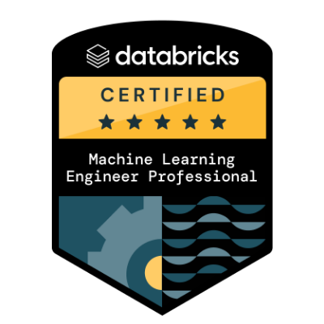
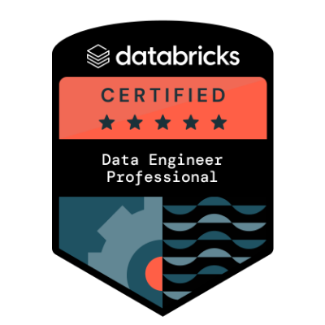
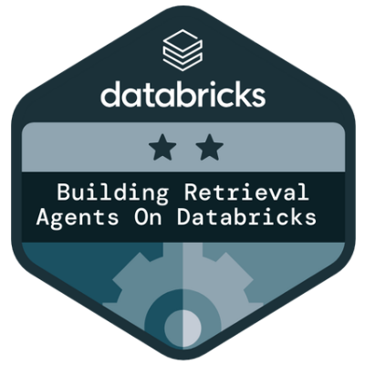

# Hi there 👋

**DATABRICKS SOLUTIONS ARCHITECT  |  DW/DE/AI/ML  |  LONDON**

---

## 😎 About me

- 🛰&nbsp; Databricks Solutions Architect
- 🌱&nbsp; Engineering, AI/ML, Data Engineering
- 👯&nbsp; I'm looking to collaborate on any good idea!
- 📫&nbsp; How to reach me: See below!
- ⚡&nbsp; Fun fact: I'm a Databricks Vibe Coding workshop facilitator

---

## ✍️ Blog and writing

<!-- TODO: drop in a blog feed (dev.to, Medium, LinkedIn articles, personal site) when you have one.
     Common patterns:
       - dev.to feed:    https://github.com/gautamkrishnar/blog-post-workflow
       - Medium feed:    https://medium-stats-api.vercel.app/
       - Static badges:   -->

_Coming soon — talks, tutorials, and posts on Databricks, AI/ML, and Vibe Coding._

---

## 📈 GitHub Stats

<!-- Self-hosted stats — generated nightly by jason-miles/github-stats workflow.
     Light/dark variants via <picture> so they look right in both GitHub themes. -->

<table>
  <tr>
    <td>
      <picture>
        <source media="(prefers-color-scheme: dark)" srcset="https://raw.githubusercontent.com/jason-miles/github-stats/generated/overview.svg#gh-dark-mode-only" />
        
      </picture>
    </td>
    <td>
      <picture>
        <source media="(prefers-color-scheme: dark)" srcset="https://raw.githubusercontent.com/jason-miles/github-stats/generated/languages.svg#gh-dark-mode-only" />
        
      </picture>
    </td>
  </tr>
</table>

  
📊 More stats (streak)

   

  

---

## 🏅 Certificates & Trainings

  

### Databricks Certified Professional

  
  &nbsp;&nbsp;
  
  &nbsp;&nbsp;
  

  <em>Machine Learning Engineer Professional · Data Engineer Professional · Building Retrieval Agents on Databricks</em>

### More Databricks credentials

- 🎓 **[Databricks Certified Generative AI Engineer Associate](https://credentials.databricks.com/profile/jasonmiles-bcs/wallet)** — May 2025
- 🎓 **[Databricks Certified Data Engineer Associate](https://credentials.databricks.com/profile/jasonmiles-bcs/wallet)** — January 2025
- 🏷️ **[Academy Accreditation — Generative AI Fundamentals](https://credentials.databricks.com/profile/jasonmiles-bcs/wallet)** — March 2025
- 🏷️ **[Academy Accreditation — Databricks Lakehouse Fundamentals](https://credentials.databricks.com/profile/jasonmiles-bcs/wallet)** — October 2024
- 🏆 **DAIS FE Accreditation 2025** — July 2025  *(Field & Sales Enablement)*

### External vendor certifications

- ❄️ **[SnowPro Core Certification](https://credentials.databricks.com/profile/jasonmiles-bcs/wallet)** — January 2024  *(Snowflake)*

🎓 Certification · 🏷️ Accreditation · 🏆 Internal accreditation · ❄️ External vendor cert

---

## 🚀 Pinned projects

- **[dbx-mlpro-cert](https://github.com/jason-miles/dbx-mlpro-cert)** — Databricks Machine Learning Professional mock exam app (FastAPI + React). 171-Q topic bank, Advanced MLOps, ML at Scale, and 3 Udemy practice exams with AI-reasoned answer keys.
- **[dbx-depro-cert](https://github.com/jason-miles/dbx-depro-cert)** — Databricks Data Engineer Professional mock exam app.
- **[vibe-coding-workshop](https://github.com/jason-miles/vibe-coding-workshop)** — Materials from the Nov 2025 Vibe Coding workshop.
- **[Operationalizing-AI-SAP-Databricks](https://github.com/jason-miles/Operationalizing-AI-SAP-Databricks)** — End-to-end pattern for operationalizing AI workloads on SAP + Databricks.

---

## 🔔 Follow me

  
  

