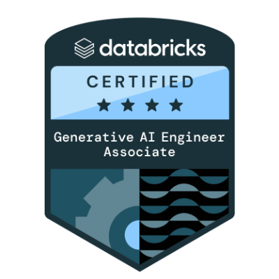
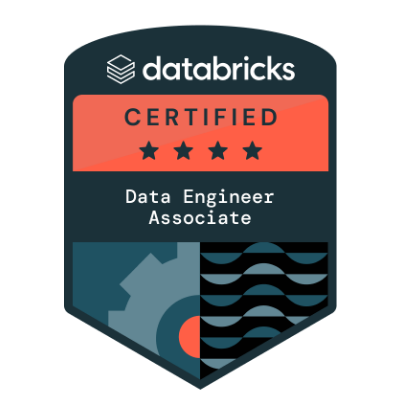
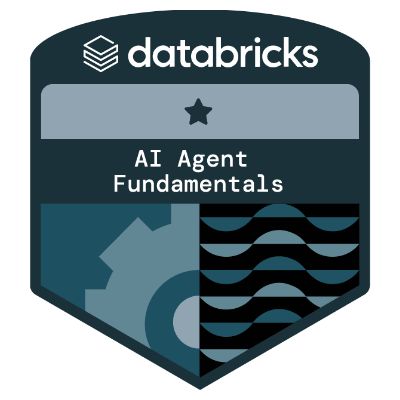
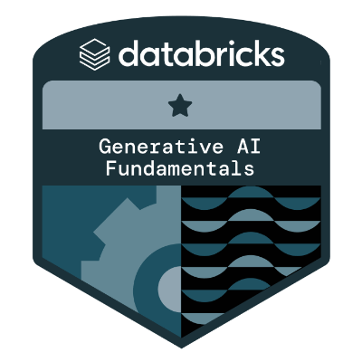
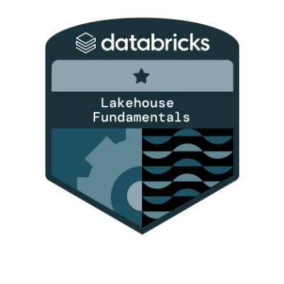
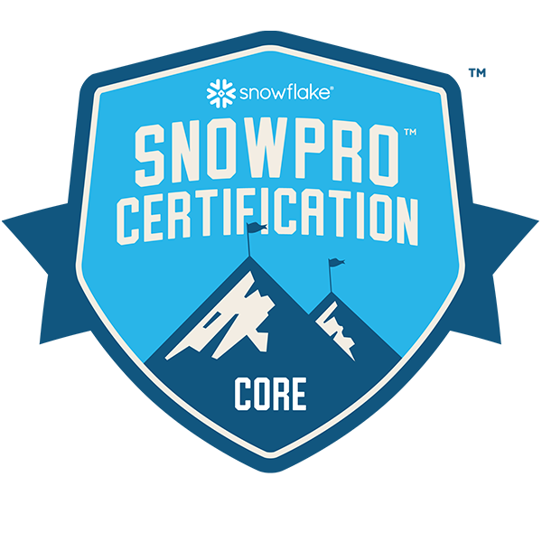

# Jason Miles

**Senior Solutions Architect · Databricks · Data Warehousing · Data Engineering · AI/ML · Generative AI**

---

## About

I'm a Solutions Architect at Databricks, helping enterprise customers turn data and AI ambitions into production reality on the Lakehouse Platform — from architecture and POC delivery to scaling ML and Generative AI workloads in production.

My focus spans Unity Catalog and Delta Lake governance, Lakeflow / Spark Declarative Pipelines, Structured Streaming, MLflow, Vector Search, and Agent systems. Databricks Certified across the Data Engineer, Machine Learning Engineer, and Generative AI tracks. Facilitator for the Databricks Vibe Coding workshop series.

Based in London · working with customers across the UK, EMEA, and South Africa.

---

## What I work with

**Databricks Platform** &nbsp;·&nbsp; Data Intelligence Platform · Unity Catalog · Delta Lake · Lakehouse Architecture · DBSQL

**Data Engineering** &nbsp;·&nbsp; Lakeflow / Spark Declarative Pipelines · Spark Structured Streaming · Apache Spark / PySpark · Data Warehousing

**AI & ML** &nbsp;·&nbsp; MLflow · Model Serving · Vector Search · Generative AI Engineering · Agent Systems / Agent Bricks · RAG

**Cloud & Languages** &nbsp;·&nbsp; AWS · Azure · GCP · Python · SQL

---

## Featured projects

| Project | What it is |
|---|---|
| **[dbx-mlpro-cert](https://github.com/jason-miles/dbx-mlpro-cert)** | Databricks ML Professional mock exam app (FastAPI + React). 171-question topic bank covering Advanced MLOps and ML at Scale, plus three full practice exams with AI-reasoned answer keys. |
| **[dbx-depro-cert](https://github.com/jason-miles/dbx-depro-cert)** | Databricks Data Engineer Professional mock exam app — same companion format, focused on Lakeflow, streaming, Delta, and Unity Catalog. |
| **[vibe-coding-workshop](https://github.com/jason-miles/vibe-coding-workshop)** | Materials, demos, and exercises from the November 2025 Vibe Coding workshop on building production AI assistants on Databricks. |
| **[Operationalizing-AI-SAP-Databricks](https://github.com/jason-miles/Operationalizing-AI-SAP-Databricks)** | End-to-end reference pattern for operationalizing AI workloads across SAP business data and the Databricks Data Intelligence Platform. |

---

## GitHub Stats

<!-- Self-hosted stats — generated nightly by jason-miles/github-stats workflow.
     Light/dark variants via <picture> so they look right in both GitHub themes. -->

<table>
  <tr>
    <td>
      <picture>
        <source media="(prefers-color-scheme: dark)" srcset="https://raw.githubusercontent.com/jason-miles/github-stats/generated/overview.svg#gh-dark-mode-only" />
        
      </picture>
    </td>
    <td>
      <picture>
        <source media="(prefers-color-scheme: dark)" srcset="https://raw.githubusercontent.com/jason-miles/github-stats/generated/languages.svg#gh-dark-mode-only" />
        
      </picture>
    </td>
  </tr>
</table>

  
More stats — streak

   
  

---

## Certifications

<strong>Databricks — Professional</strong>

  
  &nbsp;&nbsp;
  
  &nbsp;&nbsp;
  

  <em>Machine Learning Engineer Professional &nbsp;·&nbsp; Data Engineer Professional &nbsp;·&nbsp; Building Retrieval Agents on Databricks</em>

<strong>Databricks — Associate &amp; Academy Accreditations</strong>

  
  &nbsp;&nbsp;
  
  &nbsp;&nbsp;
  
  &nbsp;&nbsp;
  
  &nbsp;&nbsp;
  

  <em>GenAI Engineer Associate &nbsp;·&nbsp; Data Engineer Associate &nbsp;·&nbsp; AI Agent Fundamentals &nbsp;·&nbsp; GenAI Fundamentals &nbsp;·&nbsp; Lakehouse Fundamentals</em>

<strong>External</strong>

  

  <em>SnowPro Core Certification</em>

Also: **DAIS FE Accreditation 2025** (Databricks internal, July 2025).

[View full credentials wallet →](https://credentials.databricks.com/profile/jasonmiles-bcs/wallet)

---

## Get in touch

[Homepage](https://jason-miles.github.io) &nbsp;·&nbsp; [LinkedIn](https://www.linkedin.com/in/jasonmiles/) &nbsp;·&nbsp; [Databricks credentials](https://credentials.databricks.com/profile/jasonmiles-bcs/wallet)
