<!--
  This README is partly generated. The hero banner, the "Currently building"
  strip and the project spec cards are SVGs rebuilt nightly by
  .github/workflows/profile-refresh.yml (scripts/generate_*.py, sharing the
  brand kit in scripts/brand.py — one embedded typeface, one red accent).
  Edit prose freely; regenerate visuals with `python3 scripts/generate_*.py`.
-->

  <a href="https://jason-miles.github.io">
    
  </a>

  <a href="https://jason-miles.github.io"><b>Homepage</b></a>
  &nbsp;·&nbsp;
  <a href="https://www.linkedin.com/in/jasonmiles/"><b>LinkedIn</b></a>
  &nbsp;·&nbsp;
  <a href="https://credentials.databricks.com/profile/jasonmiles-bcs/wallet"><b>Credentials wallet</b></a>

---

## About

I'm a Solutions Architect at Databricks, helping enterprise customers turn data and AI ambitions into production reality on the Data Intelligence Platform — from architecture and POC delivery to scaling ML and Generative AI workloads in production.

My focus spans Unity Catalog and Delta Lake governance, Lakeflow / Spark Declarative Pipelines, Structured Streaming, MLflow, Vector Search, and Agent systems. Databricks Certified across the Data Engineer, Machine Learning Engineer, and Generative AI tracks. Facilitator for the Databricks Vibe Coding workshop series.

Based in London · working with customers across the UK, EMEA, and South Africa.

 

  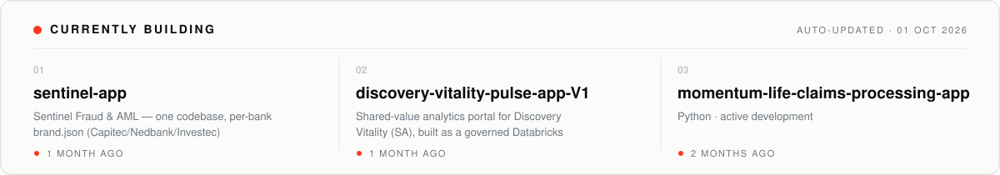

---

## Featured projects

<table>
  <tr>
    <td width="50%" valign="top">
      <a href="https://github.com/jason-miles/sentinel-app">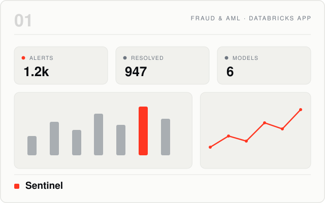</a>
      
Multi-tenant fraud &amp; AML detection — one codebase, per-bank branding (Capitec · Nedbank · Investec), shipped as a Databricks App.

    </td>
    <td width="50%" valign="top">
      <a href="https://github.com/jason-miles/discovery-vitality-pulse-app-V1">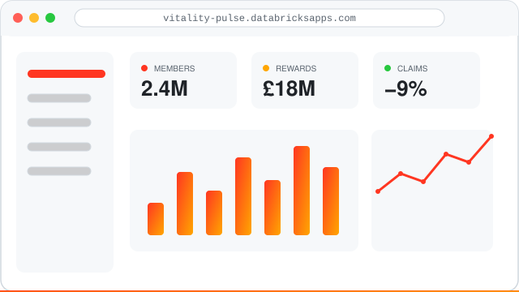</a>
      
Shared-value analytics portal quantifying how healthier member behaviour lowers claims and funds rewards — a governed Databricks App with an Ask-Genie NL hub.

    </td>
  </tr>
  <tr>
    <td width="50%" valign="top">
      <a href="https://github.com/jason-miles/dbx-mlpro-cert">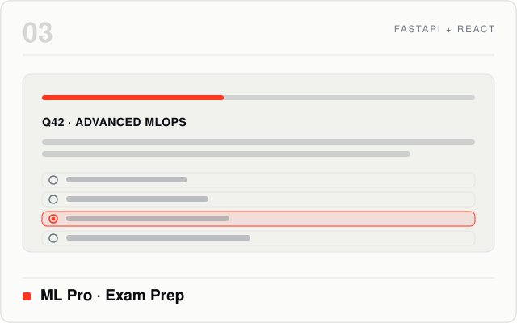</a>
      
171-question ML Professional mock-exam app — Advanced MLOps &amp; ML at Scale, three full practice exams with AI-reasoned answer keys.

    </td>
    <td width="50%" valign="top">
      <a href="https://github.com/jason-miles/dbx-depro-cert">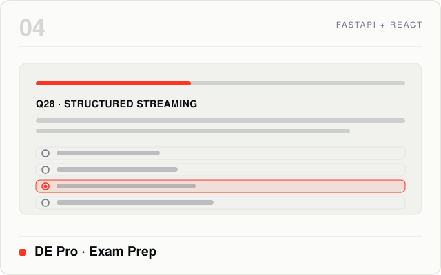</a>
      
Data Engineer Professional mock-exam app — same companion format, focused on Lakeflow, streaming, Delta, and Unity Catalog.

    </td>
  </tr>
  <tr>
    <td width="50%" valign="top">
      <a href="https://github.com/jason-miles/Operationalizing-AI-SAP-Databricks">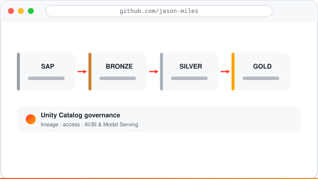</a>
      
End-to-end reference pattern for operationalizing AI workloads across SAP business data and the Databricks Data Intelligence Platform.

    </td>
    <td width="50%" valign="top">
      <a href="https://github.com/jason-miles/vibe-coding-workshop">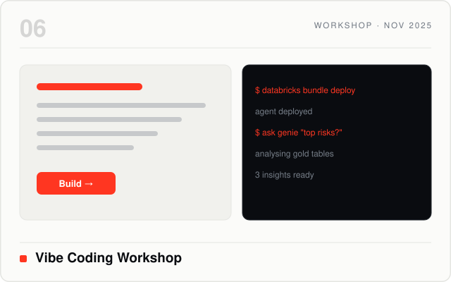</a>
      
Materials, demos and exercises from the Nov 2025 Vibe Coding workshop on building production AI assistants on Databricks.

    </td>
  </tr>
</table>

  
<b>Architecture at a glance</b> — how the two flagship Databricks Apps are wired

 

**Sentinel — Fraud & AML**

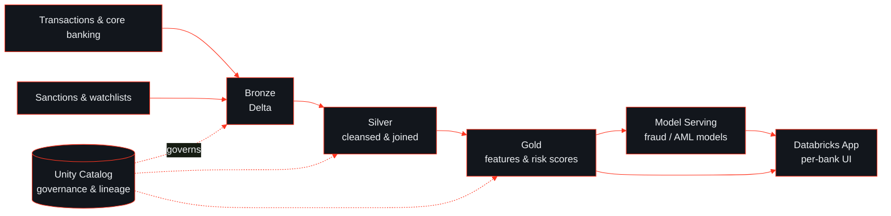
```mermaid
%%{init: {'theme':'base','themeVariables':{'primaryColor':'#12161C','primaryTextColor':'#EDF0F3','primaryBorderColor':'#FF3621','lineColor':'#FF3621','clusterBkg':'#12161C','fontFamily':'-apple-system, Segoe UI, sans-serif'}}}%%
flowchart LR
  T[Transactions & core banking] --> BZ[Bronze<br/>Delta]
  W[Sanctions & watchlists] --> BZ
  BZ --> SV[Silver<br/>cleansed & joined]
  SV --> GD[Gold<br/>features & risk scores]
  GD --> ML[Model Serving<br/>fraud / AML models]
  ML --> APP[Databricks App<br/>per-bank UI]
  GD --> APP
  UC[(Unity Catalog<br/>governance & lineage)] -.governs.-> BZ
  UC -.-> SV
  UC -.-> GD
```

**Discovery Vitality Pulse**

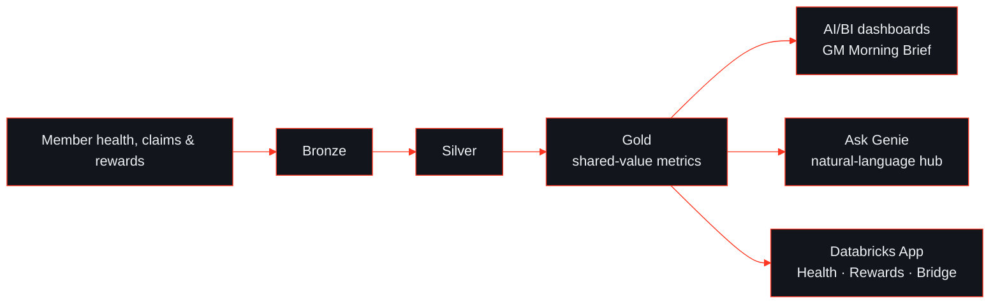
```mermaid
%%{init: {'theme':'base','themeVariables':{'primaryColor':'#12161C','primaryTextColor':'#EDF0F3','primaryBorderColor':'#FF3621','lineColor':'#FF3621','clusterBkg':'#12161C','fontFamily':'-apple-system, Segoe UI, sans-serif'}}}%%
flowchart LR
  M[Member health, claims & rewards] --> BZ[Bronze] --> SV[Silver] --> GD[Gold<br/>shared-value metrics]
  GD --> DASH[AI/BI dashboards<br/>GM Morning Brief]
  GD --> GEN[Ask Genie<br/>natural-language hub]
  GD --> APP[Databricks App<br/>Health · Rewards · Bridge]
```

---

## Toolchain

**Platform** &nbsp;—&nbsp; Data Intelligence Platform · Unity Catalog · Delta Lake · Lakehouse Architecture · DBSQL

**Data Engineering** &nbsp;—&nbsp; Lakeflow / Spark Declarative Pipelines · Spark Structured Streaming · Apache Spark / PySpark · Data Warehousing

**AI & ML** &nbsp;—&nbsp; MLflow · Model Serving · Vector Search · Generative AI Engineering · Agent Systems / Agent Bricks · RAG

**Cloud & Languages** &nbsp;—&nbsp; AWS · Azure · GCP · Python · SQL

---

## GitHub stats

<!-- Self-hosted stats — generated nightly by jason-miles/github-stats workflow.
     Light/dark variants via <picture> so they look right in both GitHub themes. -->

<table>
  <tr>
    <td>
      <picture>
        <source media="(prefers-color-scheme: dark)" srcset="https://raw.githubusercontent.com/jason-miles/github-stats/generated/overview.svg#gh-dark-mode-only" />
        
      </picture>
    </td>
    <td>
      <picture>
        <source media="(prefers-color-scheme: dark)" srcset="https://raw.githubusercontent.com/jason-miles/github-stats/generated/languages.svg#gh-dark-mode-only" />
        
      </picture>
    </td>
  </tr>
</table>

---

## Certifications

<strong>Databricks — Professional</strong>

  <a href="https://credentials.databricks.com/profile/jasonmiles-bcs/wallet" title="Databricks Certified Machine Learning Engineer Professional">
    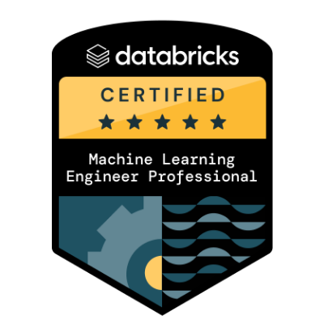
  </a>
  &nbsp;&nbsp;
  <a href="https://credentials.databricks.com/profile/jasonmiles-bcs/wallet" title="Databricks Certified Data Engineer Professional">
    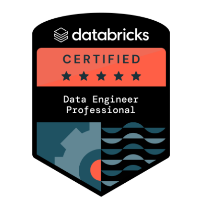
  </a>
  &nbsp;&nbsp;
  <a href="https://credentials.databricks.com/profile/jasonmiles-bcs/wallet" title="Academy Accreditation — Building Retrieval Agents on Databricks">
    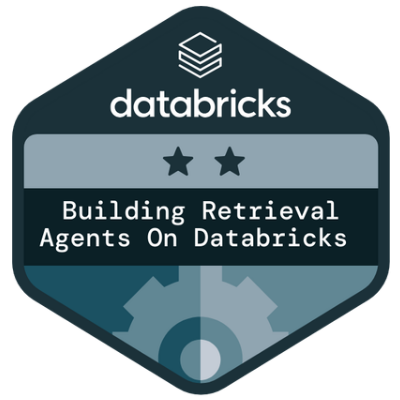
  </a>

  <em>Machine Learning Engineer Professional &nbsp;·&nbsp; Data Engineer Professional &nbsp;·&nbsp; Building Retrieval Agents on Databricks</em>

<strong>Databricks — Associate &amp; Academy Accreditations</strong>

  <a href="https://credentials.databricks.com/profile/jasonmiles-bcs/wallet" title="Databricks Certified Generative AI Engineer Associate">
    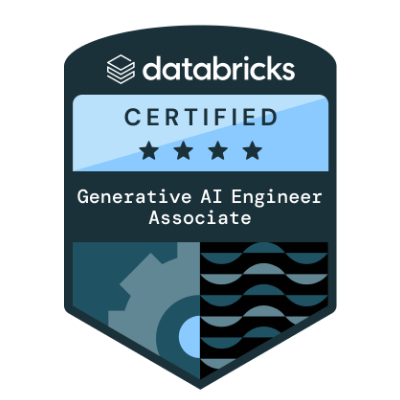
  </a>
  &nbsp;&nbsp;
  <a href="https://credentials.databricks.com/profile/jasonmiles-bcs/wallet" title="Databricks Certified Data Engineer Associate">
    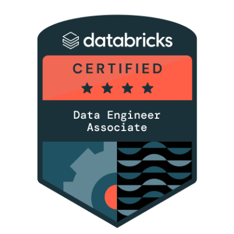
  </a>
  &nbsp;&nbsp;
  <a href="https://credentials.databricks.com/profile/jasonmiles-bcs/wallet" title="Academy Accreditation — AI Agent Fundamentals on Databricks">
    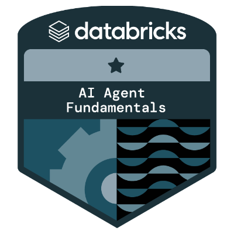
  </a>
  &nbsp;&nbsp;
  <a href="https://credentials.databricks.com/profile/jasonmiles-bcs/wallet" title="Academy Accreditation — Generative AI Fundamentals">
    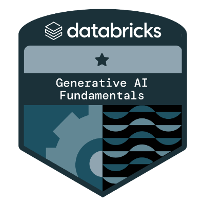
  </a>
  &nbsp;&nbsp;
  <a href="https://credentials.databricks.com/profile/jasonmiles-bcs/wallet" title="Academy Accreditation — Databricks Lakehouse Fundamentals">
    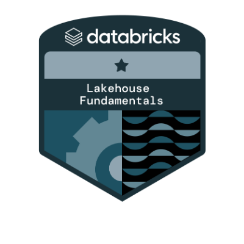
  </a>

  <em>GenAI Engineer Associate &nbsp;·&nbsp; Data Engineer Associate &nbsp;·&nbsp; AI Agent Fundamentals &nbsp;·&nbsp; GenAI Fundamentals &nbsp;·&nbsp; Lakehouse Fundamentals</em>

<strong>External</strong>

  <a href="https://achieve.snowflake.com/profile/jasonmiles/wallet" title="SnowPro Core Certification">
    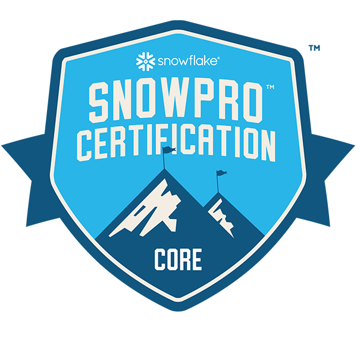
  </a>

  <em>SnowPro Core Certification</em>

  <a href="https://credentials.databricks.com/profile/jasonmiles-bcs/wallet"><b>View full credentials wallet →</b></a>

---

  
    <a href="https://jason-miles.github.io">Homepage</a> &nbsp;·&nbsp;
    <a href="https://www.linkedin.com/in/jasonmiles/">LinkedIn</a> &nbsp;·&nbsp;
    <a href="https://credentials.databricks.com/profile/jasonmiles-bcs/wallet">Databricks credentials</a>
  

